# Renovation Advisor Platform - Feature Roadmap Mind Map

## Visual Feature Status Based on PRD v2

```mermaid
mindmap
  root((Renovation Advisor Platform))
    P0 MVP
      id1[Trust & Credibility]
        Performance Bond
        Insurance Verification
        BBB Rating
        Case Studies
      id2(Client Intake)
        Multi-step Form ✓
        Photo Upload ✓
        PDF Generation ✗
        Scope Checklist ✗
      id3[Payment & Escrow]
        Stripe Connect ✗
        Material Deposit ✗
        Milestones ⚠
        Payment History ✓
      id4[Materials Management]
        Receipt Tracking
        Pricing Calculator
        Vendor Management
        Delivery Coordination
      id5(Communication Hub)
        Message Threads ✓
        Email/SMS ✓
        AI Chatbot ✓
        Progress Emails ✗
      id6[Dashboard]
        Data Isolation ✓
        Role Access ✓
        Budget Viz ✗
        Timeline ⚠
    P1 Phase 2
      id7(Automated Trust)
        Bond Widget
        Insurance Auto-verify
        Reviews Widget
      id8[Hidden Contractor Mgmt]
        Internal Database
        Performance Scoring
        Auto Assignment
    Built Infrastructure
      id9(Authentication)
        Supabase Auth
        JWT Tokens
        Protected Routes
      id10[Database]
        PostgreSQL
        Row Level Security
        Real-time Subs
      id11(UI Foundation)
        Next.js 14
        Tailwind CSS
        Shadcn Components
      id12[API Layer]
        Edge Runtime
        REST Endpoints
        Webhooks
    Cut Features
      id13((Voice Workflows))
        Takeoff Generation
        Voice Bidding
      id14((Autonomous Agents))
        Crew AI
        Morning Analysis
      id15((Advanced AI))
        Task Decomposition
        Predictive Analytics
      id16((Contractor Portal))
        Dashboard
        Bidding System
```

## Priority Matrix Based on PRD v2

### 🔥 P0 - CRITICAL MVP (Weeks 1-6)
**Must Have for Launch**

| Feature | Status | Gap Analysis |
|---------|--------|--------------|
| **F1: Trust & Credibility** | 🔴 MISSING | Need entire trust page, bonds, insurance display |
| **F2: Client Intake & Brief** | 🟡 PARTIAL | Have form, need PDF generation & scope checklist |
| **F3: Payment & Escrow** | 🟡 PARTIAL | Need Stripe Connect, material deposits, milestones |
| **F4: Materials Management** | 🔴 MISSING | Completely missing receipt tracking & savings calc |
| **F5: Communication Hub** | 🟢 MOSTLY BUILT | Just need weekly emails & better project context |
| **F6: Multi-Tenant Dashboard** | 🟡 PARTIAL | Need budget viz & timeline improvements |

### 🎯 P1 - PHASE 2 (Months 2-3)
**Scale & Efficiency**

| Feature | Status | Notes |
|---------|--------|-------|
| **F7: Automated Trust** | 🔴 PLANNED | Automate trust indicators |
| **F8: Hidden Contractor Mgmt** | 🔴 MISSING | Internal only, invisible to homeowners |

### ❌ NOT IN SCOPE - REMOVE FROM PLANS
**Over-engineered features not in PRD**

- Voice-activated anything
- Autonomous AI agents (Crew AI)
- Complex scheduling systems
- Contractor-facing features
- Advanced AI orchestration
- Task management system (Asana-like)

## Implementation Roadmap

### Sprint 0 (Week 1) ✅ DONE
- [x] Development environment
- [x] Database schema
- [x] Authentication
- [x] Basic UI components

### Sprint 1-2 (Weeks 2-3) 🟡 IN PROGRESS
- [x] Build intake form
- [ ] **PDF generation** 🔴 CRITICAL GAP
- [ ] **Project brief templates** 🔴 CRITICAL GAP

### Sprint 3-4 (Weeks 4-5) 🔴 BLOCKED
- [ ] **Materials tracking** 🔴 NOT STARTED
- [ ] **Receipt management** 🔴 NOT STARTED
- [ ] **Savings calculator** 🔴 NOT STARTED
- [x] Communication hub ✅
- [ ] **Budget tracker completion** 🟡 PARTIAL

### Sprint 5-6 (Weeks 6-7) 
- [ ] **Trust & credibility page** 🔴 CRITICAL
- [ ] **Stripe Connect escrow** 🔴 CRITICAL
- [ ] **Hidden contractor database** 🔴 CRITICAL
- [x] Email/SMS integration ✅
- [ ] Testing and bug fixes

## Critical Gaps Analysis

### 🚨 MUST BUILD IMMEDIATELY (Blocking MVP)
1. **Trust & Credibility System** - Without this, no one will trust the platform
2. **Materials Management** - Core value prop (trade discounts & savings)
3. **PDF Brief Generation** - Professional output expected by homeowners
4. **Stripe Connect Escrow** - Financial trust & payment flow

### ⚠️ EXISTING BUT INCOMPLETE
1. **Intake Form** - Needs scope checklist & permit info
2. **Payment System** - Has basic structure, needs escrow flow
3. **Dashboard** - Missing budget visualization & materials tracking

### ✅ ADEQUATELY BUILT
1. **Authentication & Security**
2. **Messaging & Communication**
3. **File Management**
4. **Basic AI Chatbot**

## Revised Success Metrics

Based on PRD v2 targets:

| Metric | Target | Current Status |
|--------|--------|----------------|
| Trust indicators | 100% visible | 0% built |
| Materials savings shown | Every project | Not tracked |
| PDF brief generation | < 10 seconds | Not built |
| Contractor invisibility | 100% hidden | Not implemented |
| Payment escrow | Fully automated | Basic only |
| Beta clients | 5-10 | Ready after gaps filled |

## Recommended Action Plan

### Week 1 Priority
1. Build trust & credibility page
2. Implement materials tracking system
3. Add PDF generation for project briefs

### Week 2 Priority  
1. Complete Stripe Connect escrow
2. Build hidden contractor database
3. Add savings calculator

### Week 3 Priority
1. Complete intake form gaps
2. Enhance budget visualization
3. Test full flow end-to-end

### Cut Immediately
- Remove all voice-related code/planning
- Remove autonomous agent references
- Simplify AI to just contextual chatbot
- Hide/remove contractor-facing features

---

*Updated: 2025-08-23 | Based on PRD v2 Requirements*